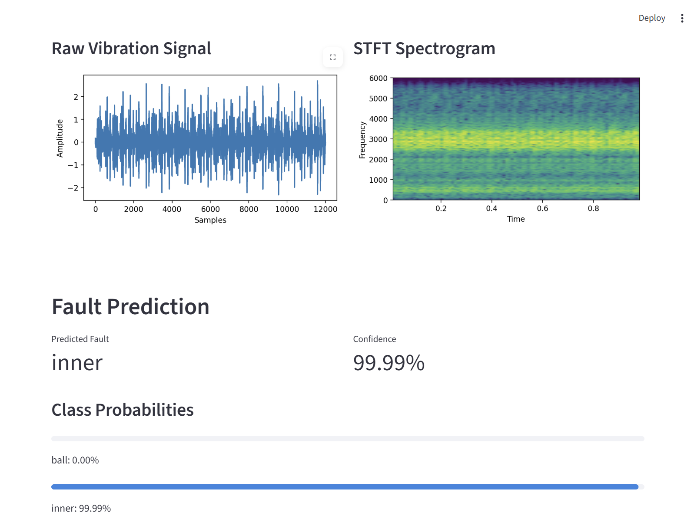
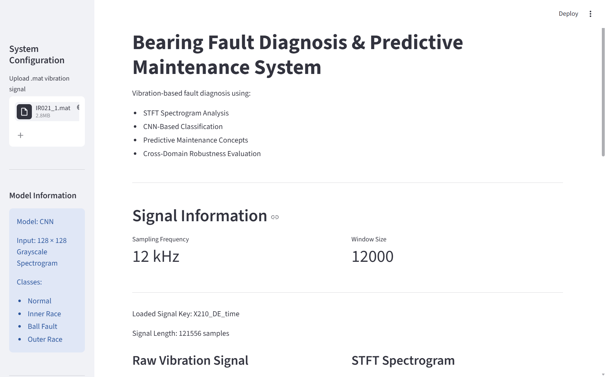

# Bearing Fault Diagnosis & Predictive Maintenance System

<p align="center">


End-to-end vibration-based bearing fault diagnosis pipeline using signal processing, STFT spectrograms, convolutional neural networks (CNNs), robustness evaluation, and cross-domain predictive maintenance analysis.

</p>

---


## Overview

This project presents an end-to-end bearing fault diagnosis and predictive maintenance pipeline using vibration signal analysis and deep learning.

The system processes raw bearing vibration signals, converts them into time-frequency spectrogram representations using Short-Time Fourier Transform (STFT), and classifies machine health conditions using a Convolutional Neural Network (CNN).

The implemented pipeline includes:

- Raw vibration signal preprocessing
- Sliding-window signal segmentation
- STFT-based spectrogram generation
- Grayscale spectrogram transformation
- CNN-based fault classification
- Robustness testing under varying conditions
- Cross-domain validation using the IMS bearing dataset
- Interactive Streamlit deployment interface

The system is designed to investigate both controlled-domain fault classification performance and the challenges of cross-domain industrial generalization in predictive maintenance systems.

## Motivation

Bearing faults are one of the most common causes of failure in rotating industrial machinery such as motors, turbines, pumps, gearboxes, and manufacturing systems.

Unexpected bearing failures can lead to:

- Unplanned machine downtime
- Production losses
- Increased maintenance costs
- Reduced operational safety
- Secondary mechanical damage

Traditional maintenance approaches are often either reactive (after failure) or schedule-based, which may not efficiently detect early-stage degradation.

Predictive maintenance systems aim to address this problem by continuously monitoring machine health and identifying fault patterns before catastrophic failure occurs.

This project explores how vibration signal processing and deep learning can be combined to automatically detect bearing faults from vibration data while also investigating the practical challenges of robustness and cross-domain generalization in industrial environments.

## Features

- End-to-end vibration-based bearing fault diagnosis pipeline
- STFT-based spectrogram generation from raw vibration signals
- Sliding-window signal segmentation for dataset generation
- CNN-based multi-class fault classification
- Classification of:
  - Normal bearing condition
  - Inner race fault
  - Ball fault
  - Outer race fault
- Grayscale spectrogram preprocessing pipeline
- Noise robustness experimentation
- Cross-load testing using multiple operating conditions
- Cross-domain validation using the IMS bearing dataset
- Interactive Streamlit-based inference interface
- Modular and extensible project structure
- Architecture documentation and evaluation workflow

## System Architecture

The following diagram illustrates the complete end-to-end workflow of the bearing fault diagnosis and predictive maintenance pipeline.

From raw vibration signal acquisition to spectrogram generation, CNN-based fault classification, deployment, and cross-domain validation, the architecture integrates signal processing, deep learning, robustness evaluation, and deployment into a unified system.

<p align="center">
  
</p>

## Dataset Information

### 1. Case Western Reserve University (CWRU) Bearing Dataset

The primary dataset used for model training and evaluation was the Case Western Reserve University (CWRU) Bearing Dataset.

The dataset contains vibration signals collected from rolling element bearings under multiple fault conditions and operating loads.

Fault categories used in this project:

- Normal bearing condition
- Inner race fault
- Ball fault
- Outer race fault

Dataset characteristics:

- Vibration-based fault signals
- Multiple operating load conditions
- Different fault severities
- Controlled laboratory environment
- STFT-based spectrogram generation pipeline

The CWRU dataset was primarily used for:

- CNN training
- Same-domain testing
- Cross-load robustness evaluation
- Noise robustness experimentation

---

### 2. IMS Bearing Dataset

To evaluate cross-domain generalization capability, the IMS Bearing Dataset from the University of Cincinnati was additionally used.

Unlike the CWRU dataset, the IMS dataset contains long-duration run-to-failure bearing data collected under real degradation progression conditions.

The IMS dataset was used to investigate:

- Cross-domain transfer behavior
- Generalization capability
- Domain shift effects
- Real-world degradation progression

This evaluation helped analyze the limitations of dataset-specific learning and highlighted the challenges of deploying deep learning-based predictive maintenance systems across different industrial environments.

## Methodology

The implemented pipeline combines vibration signal processing and deep learning-based spectrogram classification for bearing fault diagnosis.

### 1. Signal Acquisition

Raw vibration signals from bearing systems were used as the primary input for the diagnostic pipeline.

The signals were collected under multiple operating conditions and fault categories using publicly available bearing fault datasets.

---

### 2. Sliding Window Segmentation

To generate training samples, long vibration signals were segmented using a sliding-window approach.

Segmentation parameters:

- Window size: `12000`
- Step size: `9000`
- Overlap: `25%`

This process enabled the extraction of localized machine behavior while increasing the number of usable training samples.

---

### 3. Spectrogram Generation using STFT

Each segmented vibration signal was converted into a time-frequency representation using the Short-Time Fourier Transform (STFT).

STFT parameters:

- `nperseg = 256`
- `noverlap = 128`

The generated spectrograms captured the evolution of vibration frequencies over time, allowing transient fault patterns and harmonic structures to become visually distinguishable.

---

### 4. Log Scaling and Image Preprocessing

The spectrogram energy values were transformed using logarithmic scaling to compress the dynamic range and improve feature visibility.

The generated spectrograms were then:

- Converted to grayscale
- Resized to `128 × 128`
- Normalized before CNN training

---

### 5. CNN-Based Fault Classification

The processed spectrogram images were used to train a Convolutional Neural Network (CNN) for multi-class fault classification.

The CNN learned spatial spectrogram patterns corresponding to:

- Normal bearing behavior
- Inner race faults
- Ball faults
- Outer race faults

---

### 6. Robustness and Cross-Domain Evaluation

Beyond standard classification accuracy, the system was additionally evaluated under:

- Noise variation
- Different operating loads
- Cross-domain IMS dataset testing

This helped investigate model robustness, transfer behavior, and dataset dependency limitations in predictive maintenance applications.

## Model Architecture

A lightweight Convolutional Neural Network (CNN) was implemented for spectrogram-based bearing fault classification.

The model was designed to learn spatial patterns from grayscale spectrogram representations generated from vibration signals.

### CNN Architecture

The implemented architecture consists of:

- Convolutional layers for local feature extraction
- ReLU activation functions for non-linearity
- MaxPooling layers for spatial downsampling
- Fully connected layers for final classification

The network accepts:

- Input size: `1 × 128 × 128` grayscale spectrogram images

and outputs predictions for:

- Normal bearing condition
- Inner race fault
- Ball fault
- Outer race fault

---

### Feature Learning

Instead of directly learning from raw vibration signals, the CNN learns discriminative spectrogram textures and frequency-energy distributions corresponding to different fault conditions.

The convolutional layers progressively extract:

- Local harmonic structures
- Frequency band patterns
- Transient energy regions
- Time-frequency texture representations

These learned representations are then mapped to fault categories through fully connected classification layers.

---

### Design Philosophy

The model architecture was intentionally kept relatively lightweight and interpretable to focus on:

- Signal preprocessing understanding
- Spectrogram representation learning
- Robustness analysis
- Cross-domain evaluation
- Deployment feasibility

rather than maximizing architectural complexity.

## Results

### End-to-End Inference Pipeline

<p align="center">
  
</p>

### 1. Same-Domain Classification Performance (CWRU Dataset)

The CNN achieved strong classification performance on the CWRU bearing dataset under controlled experimental conditions.

The trained model successfully classified:

- Normal bearing condition
- Inner race faults
- Ball faults
- Outer race faults

The evaluation pipeline included:

- Balanced class-wise dataset generation
- Train/test separation
- Cross-load testing
- Noise robustness experimentation

The trained model demonstrated highly separable spectrogram feature learning on the controlled-domain dataset.

---

### 2. Robustness Evaluation

Additional robustness experiments were performed using:

- Noise injection
- Different operating load conditions
- Randomized inference testing

These tests helped evaluate model stability beyond standard training accuracy and verified that the model learned meaningful spectrogram representations under controlled variations.

---

### 3. Cross-Domain Validation using IMS Dataset

To evaluate generalization capability, the CWRU-trained CNN was additionally tested on the IMS run-to-failure bearing dataset.

The evaluation showed that:

- The model could partially detect degradation progression trends
- Prediction confidence evolved with degradation severity
- Some transferable spectrogram features were learned

However, the system also demonstrated clear domain dependency limitations.

Although the CNN performed strongly on the CWRU dataset, cross-domain semantic consistency was limited due to differences in:

- Machine characteristics
- Sensor distributions
- Signal statistics
- Fault progression behavior
- Spectrogram texture distributions

This highlighted the practical challenges of deploying deep learning-based predictive maintenance systems across different industrial environments without domain adaptation or multi-domain training.

## Cross-Domain Validation (IMS Dataset)

To investigate real-world generalization capability, the trained CNN was additionally evaluated on the IMS run-to-failure bearing dataset.

Unlike the CWRU dataset, which contains controlled laboratory fault recordings, the IMS dataset contains long-duration degradation data collected under realistic operating conditions.

This evaluation introduced significant domain differences, including:

- Different machine characteristics
- Different signal distributions
- Different degradation progression behavior
- Different operating environments
- Different spectrogram texture distributions

---

### Observations

The cross-domain experiments showed that:

- The model could partially detect degradation progression trends
- Prediction confidence evolved with fault severity
- Late-stage degradation produced stronger anomaly activation
- Some transferable spectrogram features were learned

However, the semantic consistency of predictions was limited across domains.

For example:

- Certain IMS degradation stages were mapped to incorrect fault classes
- Different degradation styles produced visually similar spectrogram structures
- Dataset-specific feature learning reduced transfer robustness

---

### Engineering Insight

These experiments demonstrated that high same-domain accuracy does not necessarily imply strong industrial generalization capability.

The results highlighted one of the major challenges in predictive maintenance systems:

> Deep learning models can become highly dependent on the statistical characteristics of the training dataset.

The experiments also showed the importance of:

- Dataset diversity
- Domain adaptation
- Preprocessing consistency
- Multi-domain training
- Robust feature representation learning

for real-world deployment robustness.

---

### Conclusion

The IMS evaluation served as an important robustness and transfer-learning investigation rather than a benchmark accuracy test.

This analysis significantly improved understanding of the practical limitations and deployment challenges of deep learning-based predictive maintenance systems.

## Limitations

Although the implemented system demonstrated strong same-domain classification performance on the CWRU dataset, several important limitations were identified during experimentation and cross-domain evaluation.

---

### 1. Dataset Dependency

The trained CNN was highly dependent on the statistical characteristics and spectrogram distributions of the training dataset.

As a result:

- Strong performance on the CWRU dataset did not fully transfer to the IMS dataset
- Cross-domain semantic consistency was limited
- Different degradation styles sometimes produced incorrect fault mappings

This demonstrated the challenge of dataset-specific feature learning in deep learning-based predictive maintenance systems.

---

### 2. Controlled-Domain Training

The model was primarily trained on controlled laboratory-condition datasets.

Real industrial environments may introduce:

- Sensor variation
- Different machine dynamics
- Environmental noise
- Operating condition drift
- Mechanical variability

which can significantly affect model robustness.

---

### 3. Spectrogram-Based Representation Limitations

The CNN learned from spectrogram image representations rather than directly from raw vibration physics.

As a result, the model primarily learned statistical time-frequency textures instead of true fault-invariant physical representations.

---

### 4. Preprocessing Sensitivity

Model performance was sensitive to preprocessing consistency, including:

- Spectrogram generation parameters
- Signal windowing strategy
- Scaling methods
- Image preprocessing pipeline

Small preprocessing mismatches may affect deployment robustness.

---

### 5. Lightweight Architecture Constraints

The implemented CNN architecture was intentionally lightweight for interpretability and modular experimentation.

More advanced architectures may improve:

- Feature generalization
- Cross-domain transfer capability
- Temporal degradation modeling
- Robustness under industrial variability

## Future Improvements

Several future improvements were identified during experimentation and robustness analysis.

---

### 1. Direct Tensor-Based Spectrogram Pipeline

The current implementation generates spectrogram images through visualization-based preprocessing.

Future versions will directly convert STFT spectrogram matrices into tensors to:

- Eliminate visualization artifacts
- Improve preprocessing consistency
- Increase inference efficiency
- Improve deployment robustness

---

### 2. Multi-Dataset Training

The current model was primarily trained using the CWRU dataset.

Future work will include:

- Multi-domain dataset integration
- Diverse machine conditions
- Cross-machine training
- Improved industrial variability exposure

to improve generalization capability.

---

### 3. Domain Adaptation and Transfer Learning

Future versions may include:

- Domain adaptation techniques
- Transfer learning strategies
- Feature alignment methods
- Distribution normalization approaches

to improve cross-domain robustness between industrial environments.

---

### 4. Temporal Degradation Modeling

The current CNN primarily performs static spectrogram classification.

Future extensions may incorporate:

- Temporal sequence modeling
- LSTM-based degradation tracking
- Transformer-based time-series analysis
- Remaining Useful Life (RUL) estimation

for predictive maintenance progression analysis.

---

### 5. Real-Time Streaming Inference

The current deployment pipeline is upload-based.

Future deployment goals include:

- Real-time vibration streaming
- Continuous monitoring systems
- Edge deployment optimization
- Live anomaly tracking dashboards

---

### 6. Physics-Informed Feature Learning

Future research directions may include combining:

- Signal-processing-based fault features
- Bearing characteristic frequencies
- Physics-informed modeling
- Hybrid deep learning approaches

to improve fault-invariant representation learning.

## Installation

### 1. Clone the Repository

```bash
git clone https://github.com/your-username/Bearing-Fault-Diagnosis-System.git

cd Bearing-Fault-Diagnosis-System
```

---

### 2. Create Virtual Environment (Recommended)

```bash
python -m venv venv
```

Activate environment:

#### Windows

```bash
venv\Scripts\activate
```

#### Linux / macOS

```bash
source venv/bin/activate
```

---

### 3. Install Dependencies

```bash
pip install -r requirements.txt
```

---

### 4. Verify PyTorch Installation

```bash
python -c "import torch; print(torch.__version__)"
```

---

### 5. Launch Streamlit Application

```bash
cd app

streamlit run streamlit_app.py
```

## Usage

### 1. Dataset Generation

Generate spectrogram datasets from raw vibration signals:

```bash
cd src

python dataset_generator.py
```

This pipeline performs:

- Sliding-window segmentation
- STFT spectrogram generation
- Log scaling
- Grayscale preprocessing
- Dataset organization

---

### 2. Model Training

Train the CNN model on generated spectrogram datasets:

```bash
cd src

python train.py
```

The training pipeline includes:

- CNN training
- Train/test evaluation
- Accuracy tracking
- Robustness experimentation
- Model checkpoint saving

---

### 3. Inference Testing

Run inference on individual spectrogram samples:

```bash
cd src

python inference.py
```

This outputs:

- Predicted fault class
- Confidence score
- Fault classification result

---

### 4. IMS Cross-Domain Evaluation

Evaluate the trained model on IMS bearing degradation data:

```bash
cd src

python ims_adapter.py
```

This pipeline evaluates:

- Cross-domain transfer behavior
- Degradation progression response
- Domain dependency limitations

---

### 5. Streamlit Deployment

Launch the interactive deployment interface:

```bash
cd app

streamlit run streamlit_app.py
```

The Streamlit application supports:

- Signal upload
- Spectrogram generation
- CNN inference
- Confidence visualization
- Interactive fault prediction

## Streamlit Deployment

### Dashboard Interface

<p align="center">
  
</p>

An interactive Streamlit-based deployment interface was developed for real-time inference experimentation and demonstration.

The application allows users to:

- Upload vibration signal files
- Generate spectrogram representations
- Perform CNN-based fault classification
- Visualize prediction confidence
- Interactively test bearing condition predictions

---

### Deployment Workflow

The deployment pipeline performs:

1. Signal loading
2. Signal preprocessing
3. STFT spectrogram generation
4. Grayscale transformation
5. CNN inference
6. Fault prediction display

---

### Supported Fault Categories

The deployed model predicts:

- Normal bearing condition
- Inner race fault
- Ball fault
- Outer race fault

---

### Deployment Objective

The Streamlit interface was designed to demonstrate how vibration-based predictive maintenance systems can be converted from experimental machine learning pipelines into deployable engineering applications.

## Repository Structure

## Repository Structure

```text
Bearing-Fault-Diagnosis-System/
│
├── app/
│   └── streamlit_app.py
│
├── docs/
│   └── figures/
│       └── screenshots/
│
├── experiments/
│   ├── compare_domains.py
│   ├── ims_temporal_test.py
│   └── test_ims_adapter.py
│
├── models/
│   └── bearing_cnn.pth
│
├── src/
│   ├── model.py
│   ├── train.py
│   ├── inference.py
│   ├── evaluate.py
│   ├── dataloader.py
│   ├── signal_to_spectrogram.py
│   ├── ims_adapter.py
│   └── utils.py
│
├── README.md
├── LICENSE
├── requirements.txt
└── .gitignore
```

## Technologies Used

### Programming & Frameworks

- Python
- PyTorch
- Streamlit

---

### Signal Processing

- NumPy
- SciPy
- STFT (Short-Time Fourier Transform)

---

### Data Processing & Visualization

- Matplotlib
- Pillow (PIL)
- OpenCV

---

### Machine Learning & Evaluation

- Convolutional Neural Networks (CNNs)
- Scikit-learn

---

### Datasets

- CWRU Bearing Dataset
- IMS Bearing Dataset

---

### Development Environment

- VS Code
- Git
- GitHub

## Future Roadmap

### Phase 1 — Core Fault Diagnosis System 

Completed components:

- Vibration signal preprocessing pipeline
- Sliding-window dataset generation
- STFT spectrogram generation
- Grayscale preprocessing pipeline
- CNN-based fault classification
- Same-domain robustness testing
- IMS cross-domain evaluation
- Streamlit deployment interface
- Modular project restructuring
- System architecture documentation

---

### Phase 2 — Engineering Presentation & Documentation 

Current focus areas:

- README engineering
- Architecture documentation
- Experimental result organization
- Deployment refinement
- Evaluation visualization
- Project presentation optimization

---

### Phase 3 — Advanced Robust Predictive Maintenance System 

Planned future extensions:

- Direct tensor-based spectrogram processing
- Multi-dataset training
- Domain adaptation
- Transfer learning pipelines
- Temporal degradation modeling
- Real-time vibration streaming
- Remaining Useful Life (RUL) estimation
- Physics-informed feature learning
- Industrial robustness optimization

## License

This project is licensed under the MIT License.

Feel free to use, modify, and extend this project for educational and research purposes.
